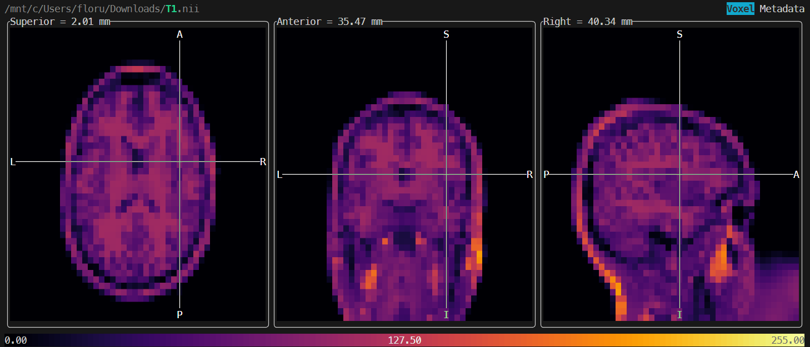

# `headjack` - Interactive NIfTI Viewer for the Terminal

`headjack` is a versatile NIfTI image viewer tailored for the terminal. It offers seamless compatibility with most platforms, including remote clusters and containerized environments, making it an ideal choice for researchers and developers.



## Usage

To view NIfTI images in the terminal, simply run:

```sh
headjack image.nii.gz
```

### Controls

Use the following controls to navigate and interact with the viewer:

| Key | Action |
| --- | --- |
| <kbd>&uarr;</kbd> <kbd>&darr;</kbd> or <kbd>A</kbd> <kbd>D</kbd> | Navigate along the X-axis / Scroll through metadata |
| <kbd>&larr;</kbd> <kbd>&rarr;</kbd> or <kbd>W</kbd> <kbd>S</kbd> | Navigate along the Y-axis / Scroll through metadata |
| <kbd>Z</kbd> <kbd>X</kbd> or <kbd>Y</kbd> <kbd>X</kbd> | Navigate along the Z-axis |
| <kbd>Tab</kbd> | Toggle metadata view |
| <kbd>C</kbd> | Toggle color map |
| <kbd>Q</kbd> or <kbd>Esc</kbd> or <kbd>Ctrl</kbd> + <kbd>C</kbd>  | Quit |

## Installation

### Precompiled Binaries (Recommended)

We recommend downloading the latest precompiled binary for your platform from the [releases](https://github.com/cmi-dair/headjack/releases) page. Optionally, you can add the binary to your `PATH` environment variable for easier access. `headjack` is a self-contained executable with no runtime dependencies.

To simplify access, consider aliasing the binary to `hj`:

```sh
alias hj=/path/to/headjack
```


### Build from source

If you prefer to build `headjack` from source, ensure you have the latest Rust compiler installed and then run:

```sh
cargo build --release
```

The binary will be located at `target/release/headjack`.

## Troubleshooting

### Terminal Colors Issue

If your terminal displays colors incorrectly, it may not support 24-bit colors. You can try running headjack with the `-a`/`--ansi` flag for 256 ANSI color mode.

### Unix: Libc Error on Startup

If you encounter an error related to `libc` when starting headjack, such as:

```
/lib64/libm.so.6: versionGLIBC_2.29' not found
```

It likely indicates that you are using an older version of glibc. Consider using the `*-musl`  variant available on the [releases page](https://github.com/cmi-dair/headjack/releases), or build `headjack` from source with the `musl` target.
